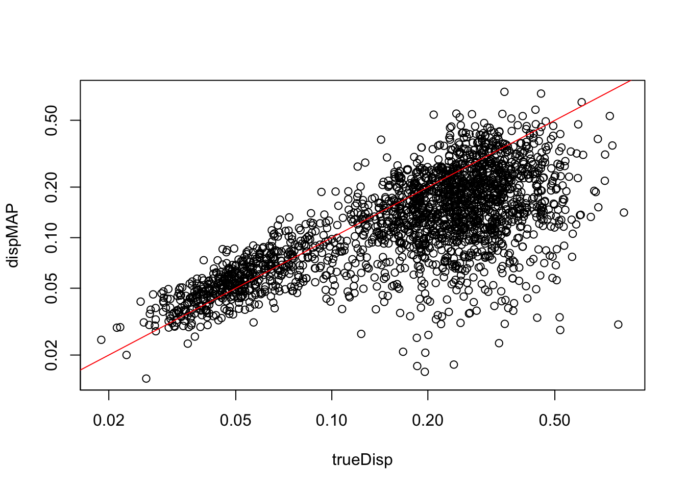
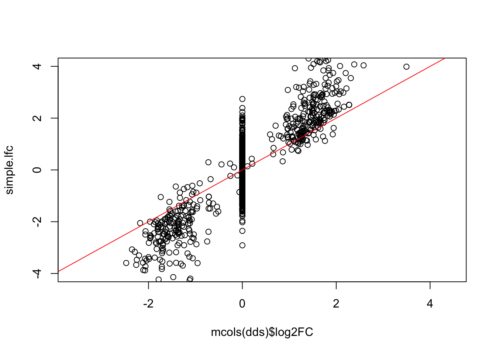

Here we use the *splatter* package to simulate single-cell RNA-seq
data.

* Zappia, Phipson, and Oshlack "Splatter: simulation of single-cell RNA
sequencing data" *Genome Biology* (2017)
[doi: 10.1186/s13059-017-1305-0](https://doi.org/10.1186/s13059-017-1305-0)

We then use the methods defined in the following paper to combine
*zinbwave* observation weights with *DESeq2* modeling of negative
binomial counts.

* Van den Berge & Perraudeau *et al* "Observation weights unlock bulk
RNA-seq tools for zero inflation and single-cell applications" *Genome Biology* (2018)
[doi: 10.1186/s13059-018-1406-4](https://doi.org/10.1186/s13059-018-1406-4)

> It is important to note that while methods such as ZINB-WaVE and
> ZINGER can successfully identify excess zeros, they cannot, however,
> readily discriminate between their underlying causes, i.e., between
> technical (e.g., dropout) and biological (e.g., bursting) zeros. 

The above note implies that the zero-inflation weighting approach
outlined below can be used when the interesting signal is not in the
zero component. That is, if you wanted to find biological differences
in transcriptional bursting across groups of cells, the below approach
would not help you find these differences. It instead helps to uncover
differences in counts besides the zero component (whether those zeros
be biological or technical). 

### Simulate single-cell count data with *splatter*


```r
suppressPackageStartupMessages(library(splatter))
params <- newSplatParams()
#params
#slotNames(params)
# note: these DE params are natural log scale
params <- setParam(params, "de.facLoc", 1) 
params <- setParam(params, "de.facScale", .25)
# add a lot more dropout - see if ZI weighting works
params <- setParam(params, "dropout.type", "experiment")
params <- setParam(params, "dropout.mid", 3)
```


```r
set.seed(1)
sim <- splatSimulate(params, group.prob=c(.5,.5), method="groups")
```

```
## Getting parameters...
```

```
## Creating simulation object...
```

```
## Simulating library sizes...
```

```
## Simulating gene means...
```

```
## Simulating group DE...
```

```
## Simulating cell means...
```

```
## Simulating BCV...
```

```
## Simulating counts...
```

```
## Simulating dropout (if needed)...
```

```
## Done!
```

```r
# hist(rowSums(counts(sim) >= 1))
```


```r
plot(log10(rowMeans(assays(sim)[["TrueCounts"]])), rowMeans(assays(sim)[["Dropout"]]))
```


```r
# note: each group gets it's own DE genes -- meaning some will be "doubly DE"
#z <- rowData(sim)$DEFacGroup1
#hist(log(z[z > 1]), breaks=30, col="grey", freq=FALSE, ylim=c(0,5))
rowData(sim)$log2FC <- with(rowData(sim), log2(DEFacGroup2/DEFacGroup1))
```


```r
rowData(sim)$trueDisp <- rowMeans(assays(sim)[["BCV"]])^2
gridlines <- c(1e-2,1e-1,1); cols <- c("blue","red","darkgreen")
with(rowData(sim)[rowData(sim)$GeneMean> 1,],
     plot(GeneMean, trueDisp, log="xy", xlim=c(1,300), ylim=c(.01,5)))
abline(h=gridlines, col=cols)
text(300, gridlines, labels=gridlines, col=cols, pos=3)
```


### Model zero component using *zinbwave*


```r
library(zinbwave)
library(BiocParallel)
# low count filter - at least 10 with count of 5 or more
keep <- rowSums(counts(sim) >= 5) >= 10
table(keep)
```

```
## keep
## FALSE  TRUE 
##  7914  2086
```

```r
zinb <- sim[keep,]
zinb$condition <- factor(zinb$Group)
# we need to reorganize the assays in the SumExp from splatter
nms <- c("counts", setdiff(assayNames(zinb), "counts"))
assays(zinb) <- assays(zinb)[nms]
# epsilon setting as recommended by the ZINB-WaVE integration paper
system.time({
  zinb <- zinbwave(zinb, K=0, observationalWeights=TRUE,
                   BPPARAM=SerialParam(), epsilon=1e12)
})
```

```
##    user  system elapsed 
##  31.183   3.240  35.275
```

### Estimate size factors


```r
suppressPackageStartupMessages(library(DESeq2))
dds <- DESeqDataSet(zinb, design=~condition)
dds <- estimateSizeFactors(dds, type="poscounts")
library(scran)
scr <- computeSumFactors(dds)
dat <- data.frame(true=dds$ExpLibSize,
                  pos=sizeFactors(dds),
                  sum=sizeFactors(scr))
dat$true <- dat$true / exp(mean(log(dat$true)))
panel.scatter <- function(x,y,...) {
  points(x,y,...)
  abline(0,1,col="red",lwd=2)
  legend("topleft", legend=round(cor(x,y),3))
}
pairs(dat, panel=panel.scatter)
```


### Estimate dispersion and DE using *DESeq2*

Van den Berge and Perraudeau and others have shown the LRT may perform
better for null hypothesis testing, so we use the LRT. In order to use
the Wald test, it is recommended to set `useT=TRUE`.


```r
# use scran's sum factors:
sizeFactors(dds) <- sizeFactors(scr)
# run DESeq:
system.time({
  dds <- DESeq(dds, test="LRT", reduced=~1,
               minmu=1e-6, minRep=Inf)
})
```

```
## using pre-existing size factors
```

```
## estimating dispersions
```

```
## gene-wise dispersion estimates
```

```
## Warning in getAndCheckWeights(object, modelMatrix, weightThreshold = weightThreshold): for 2 row(s), the weights as supplied won't allow parameter estimation, producing a
##   degenerate design matrix. These rows have been flagged in mcols(dds)$weightsFail
##   and treated as if the row contained all zeros (mcols(dds)$allZero set to TRUE).
##   If you are blocking for donors/organisms, consider design = ~0+donor+condition.
```

```
## mean-dispersion relationship
```

```
## final dispersion estimates
```

```
## fitting model and testing
```

```
##    user  system elapsed 
##  14.940   0.307  15.459
```

### Plot dispersion estimates

It is recommended to plot the dispersion estimates for *DESeq2* on
single-cell data. As discussed in the *DESeq2* paper, it becomes
difficult to accurately estimate the dispersion when the counts are
very small, because the Poisson component of the variance is
dominant. Therefore we see some very low dispersion estimates here,
although the trend is still accurately capturing the upper proportion.
So here everything looks good.


```r
plotDispEsts(dds)
```


If the parametric trend fails to fit (there would be a warning in this
case), one should check the dispersion plot as above. If it looks like
the dispersion fit is being thrown off by the low count genes with low
dispersion estimates at the bottom of the plot, there is a relatively
easy solution: one can filter out more of the low count genes only for
the dispersion estimation step, so that the trend still captures the upper
portion. This is pretty easy to do in *DESeq2*, to filter genes solely
for the dispersion trend estimation, but to use a larger set for the
rest of the analysis. An example of how this can be done:


```r
keepForDispTrend <- rowSums(counts(dds) >= 10) >= 25
dds2 <- estimateDispersionsFit(dds[keepForDispTrend,])
plotDispEsts(dds2, ylim=c(1e-3,1))
```


One would then assign the dispersion function to the original dataset,
re-estimate final dispersions, check `plotDispEsts`, and then either
re-run the Wald or LRT function (this chunk not evaluated):


```r
dispersionFunction(dds) <- dispersionFunction(dds2)
dds <- estimateDispersionsMAP(dds)
dds <- nbinomLRT(dds, reduced=~1, minmu=1e-6)
```

### Evaluate how well we did on simulated data

Compare dispersion on the non-zero-component counts to the true value
used for simulation. 


```r
with(mcols(dds), plot(trueDisp, dispMAP, log="xy"))
abline(0,1,col="red")
```



Extract results table.


```r
# we already performed low count filtering
res <- results(dds, independentFiltering=FALSE)
plot(mcols(dds)$log2FC, res$log2FoldChange, ylim=c(-4,4)); abline(0,1,col="red")
```


Below we show that the "simple" LFC does not work - it over-estimates
the true DE LFC because of the dropout zeros in the group with the
smaller mean. It also has a lot of noise for the null genes.


```r
ncts <- counts(dds, normalized=TRUE)
simple.lfc <- log2(rowMeans(ncts[,dds$condition == "Group2"])/
                   rowMeans(ncts[,dds$condition == "Group1"]))
plot(mcols(dds)$log2FC, simple.lfc, ylim=c(-4,4)); abline(0,1,col="red")
```



How well do we do in null hypothesis testing:


```r
tab <- table(DE.status=mcols(dds)$log2FC != 0, sig=res$padj < .05)
tab
```

```
##          sig
## DE.status FALSE TRUE
##     FALSE  1587   32
##     TRUE    125  340
```

```r
round(prop.table(tab, 2), 3)
```

```
##          sig
## DE.status FALSE  TRUE
##     FALSE 0.927 0.086
##     TRUE  0.073 0.914
```


```r
session_info()
```

```
## ─ Session info ───────────────────────────────────────────────────────────────────────────────────
##  setting  value                       
##  version  R version 4.0.0 (2020-04-24)
##  os       macOS Catalina 10.15.4      
##  system   x86_64, darwin17.0          
##  ui       X11                         
##  language (EN)                        
##  collate  en_US.UTF-8                 
##  ctype    en_US.UTF-8                 
##  tz       America/New_York            
##  date     2020-05-16                  
## 
## ─ Packages ───────────────────────────────────────────────────────────────────────────────────────
##  package              * version  date       lib source        
##  annotate               1.67.0   2020-04-27 [1] Bioconductor  
##  AnnotationDbi          1.51.0   2020-04-27 [1] Bioconductor  
##  assertthat             0.2.1    2019-03-21 [1] CRAN (R 4.0.0)
##  backports              1.1.6    2020-04-05 [1] CRAN (R 4.0.0)
##  beeswarm               0.2.3    2016-04-25 [1] CRAN (R 4.0.0)
##  Biobase              * 2.49.0   2020-04-27 [1] Bioconductor  
##  BiocGenerics         * 0.35.2   2020-05-06 [1] Bioconductor  
##  BiocManager            1.30.10  2019-11-16 [1] CRAN (R 4.0.0)
##  BiocNeighbors          1.7.0    2020-04-27 [1] Bioconductor  
##  BiocParallel         * 1.23.0   2020-04-27 [1] Bioconductor  
##  BiocSingular           1.5.0    2020-04-27 [1] Bioconductor  
##  bit                    1.1-15.2 2020-02-10 [1] CRAN (R 4.0.0)
##  bit64                  0.9-7    2017-05-08 [1] CRAN (R 4.0.0)
##  bitops                 1.0-6    2013-08-17 [1] CRAN (R 4.0.0)
##  blob                   1.2.1    2020-01-20 [1] CRAN (R 4.0.0)
##  callr                  3.4.3    2020-03-28 [1] CRAN (R 4.0.0)
##  checkmate              2.0.0    2020-02-06 [1] CRAN (R 4.0.0)
##  cli                    2.0.2    2020-02-28 [1] CRAN (R 4.0.0)
##  colorspace             1.4-1    2019-03-18 [1] CRAN (R 4.0.0)
##  crayon                 1.3.4    2017-09-16 [1] CRAN (R 4.0.0)
##  DBI                    1.1.0    2019-12-15 [1] CRAN (R 4.0.0)
##  DelayedArray         * 0.15.1   2020-05-01 [1] Bioconductor  
##  DelayedMatrixStats     1.11.0   2020-04-27 [1] Bioconductor  
##  desc                   1.2.0    2018-05-01 [1] CRAN (R 4.0.0)
##  DESeq2               * 1.29.3   2020-05-15 [1] Bioconductor  
##  devtools             * 2.3.0    2020-04-10 [1] CRAN (R 4.0.0)
##  digest                 0.6.25   2020-02-23 [1] CRAN (R 4.0.0)
##  dplyr                  0.8.5    2020-03-07 [1] CRAN (R 4.0.0)
##  dqrng                  0.2.1    2019-05-17 [1] CRAN (R 4.0.0)
##  edgeR                  3.31.0   2020-04-27 [1] Bioconductor  
##  ellipsis               0.3.0    2019-09-20 [1] CRAN (R 4.0.0)
##  evaluate               0.14     2019-05-28 [1] CRAN (R 4.0.0)
##  fansi                  0.4.1    2020-01-08 [1] CRAN (R 4.0.0)
##  fs                     1.4.1    2020-04-04 [1] CRAN (R 4.0.0)
##  genefilter             1.71.0   2020-04-27 [1] Bioconductor  
##  geneplotter            1.67.0   2020-04-27 [1] Bioconductor  
##  GenomeInfoDb         * 1.25.0   2020-04-27 [1] Bioconductor  
##  GenomeInfoDbData       1.2.3    2020-04-25 [1] Bioconductor  
##  GenomicRanges        * 1.41.1   2020-05-02 [1] Bioconductor  
##  ggbeeswarm             0.6.0    2017-08-07 [1] CRAN (R 4.0.0)
##  ggplot2                3.3.0    2020-03-05 [1] CRAN (R 4.0.0)
##  glue                   1.4.0    2020-04-03 [1] CRAN (R 4.0.0)
##  gridExtra              2.3      2017-09-09 [1] CRAN (R 4.0.0)
##  gtable                 0.3.0    2019-03-25 [1] CRAN (R 4.0.0)
##  htmltools              0.4.0    2019-10-04 [1] CRAN (R 4.0.0)
##  igraph                 1.2.5    2020-03-19 [1] CRAN (R 4.0.0)
##  IRanges              * 2.23.4   2020-05-03 [1] Bioconductor  
##  irlba                  2.3.3    2019-02-05 [1] CRAN (R 4.0.0)
##  knitr                  1.28     2020-02-06 [1] CRAN (R 4.0.0)
##  lattice                0.20-41  2020-04-02 [1] CRAN (R 4.0.0)
##  lifecycle              0.2.0    2020-03-06 [1] CRAN (R 4.0.0)
##  limma                  3.45.0   2020-04-27 [1] Bioconductor  
##  locfit                 1.5-9.4  2020-03-25 [1] CRAN (R 4.0.0)
##  magrittr               1.5      2014-11-22 [1] CRAN (R 4.0.0)
##  Matrix                 1.2-18   2019-11-27 [1] CRAN (R 4.0.0)
##  matrixStats          * 0.56.0   2020-03-13 [1] CRAN (R 4.0.0)
##  memoise                1.1.0    2017-04-21 [1] CRAN (R 4.0.0)
##  munsell                0.5.0    2018-06-12 [1] CRAN (R 4.0.0)
##  pillar                 1.4.4    2020-05-05 [1] CRAN (R 4.0.0)
##  pkgbuild               1.0.8    2020-05-07 [1] CRAN (R 4.0.0)
##  pkgconfig              2.0.3    2019-09-22 [1] CRAN (R 4.0.0)
##  pkgload                1.0.2    2018-10-29 [1] CRAN (R 4.0.0)
##  prettyunits            1.1.1    2020-01-24 [1] CRAN (R 4.0.0)
##  processx               3.4.2    2020-02-09 [1] CRAN (R 4.0.0)
##  ps                     1.3.3    2020-05-08 [1] CRAN (R 4.0.0)
##  purrr                  0.3.4    2020-04-17 [1] CRAN (R 4.0.0)
##  R6                     2.4.1    2019-11-12 [1] CRAN (R 4.0.0)
##  RColorBrewer           1.1-2    2014-12-07 [1] CRAN (R 4.0.0)
##  Rcpp                   1.0.4.6  2020-04-09 [1] CRAN (R 4.0.0)
##  RCurl                  1.98-1.2 2020-04-18 [1] CRAN (R 4.0.0)
##  remotes                2.1.1    2020-02-15 [1] CRAN (R 4.0.0)
##  rlang                  0.4.6    2020-05-02 [1] CRAN (R 4.0.0)
##  rmarkdown            * 2.1      2020-01-20 [1] CRAN (R 4.0.0)
##  rprojroot              1.3-2    2018-01-03 [1] CRAN (R 4.0.0)
##  RSQLite                2.2.0    2020-01-07 [1] CRAN (R 4.0.0)
##  rsvd                   1.0.3    2020-02-17 [1] CRAN (R 4.0.0)
##  S4Vectors            * 0.27.5   2020-05-06 [1] Bioconductor  
##  scales                 1.1.1    2020-05-11 [1] CRAN (R 4.0.0)
##  scater                 1.17.0   2020-04-27 [1] Bioconductor  
##  scran                * 1.17.0   2020-04-27 [1] Bioconductor  
##  sessioninfo            1.1.1    2018-11-05 [1] CRAN (R 4.0.0)
##  SingleCellExperiment * 1.11.1   2020-04-28 [1] Bioconductor  
##  softImpute             1.4      2015-04-08 [1] CRAN (R 4.0.0)
##  splatter             * 1.13.0   2020-05-14 [1] Bioconductor  
##  statmod                1.4.34   2020-02-17 [1] CRAN (R 4.0.0)
##  stringi                1.4.6    2020-02-17 [1] CRAN (R 4.0.0)
##  stringr                1.4.0    2019-02-10 [1] CRAN (R 4.0.0)
##  SummarizedExperiment * 1.19.2   2020-05-01 [1] Bioconductor  
##  survival               3.1-12   2020-04-10 [1] CRAN (R 4.0.0)
##  testthat             * 2.3.2    2020-03-02 [1] CRAN (R 4.0.0)
##  tibble                 3.0.1    2020-04-20 [1] CRAN (R 4.0.0)
##  tidyselect             1.0.0    2020-01-27 [1] CRAN (R 4.0.0)
##  usethis              * 1.6.1    2020-04-29 [1] CRAN (R 4.0.0)
##  vctrs                  0.2.4    2020-03-10 [1] CRAN (R 4.0.0)
##  vipor                  0.4.5    2017-03-22 [1] CRAN (R 4.0.0)
##  viridis                0.5.1    2018-03-29 [1] CRAN (R 4.0.0)
##  viridisLite            0.3.0    2018-02-01 [1] CRAN (R 4.0.0)
##  withr                  2.2.0    2020-04-20 [1] CRAN (R 4.0.0)
##  xfun                   0.13     2020-04-13 [1] CRAN (R 4.0.0)
##  XML                    3.99-0.3 2020-01-20 [1] CRAN (R 4.0.0)
##  xtable                 1.8-4    2019-04-21 [1] CRAN (R 4.0.0)
##  XVector                0.29.0   2020-04-27 [1] Bioconductor  
##  yaml                   2.2.1    2020-02-01 [1] CRAN (R 4.0.0)
##  zinbwave             * 1.11.0   2020-05-14 [1] Bioconductor  
##  zlibbioc               1.35.0   2020-04-27 [1] Bioconductor  
## 
## [1] /Library/Frameworks/R.framework/Versions/4.0/Resources/library
```
